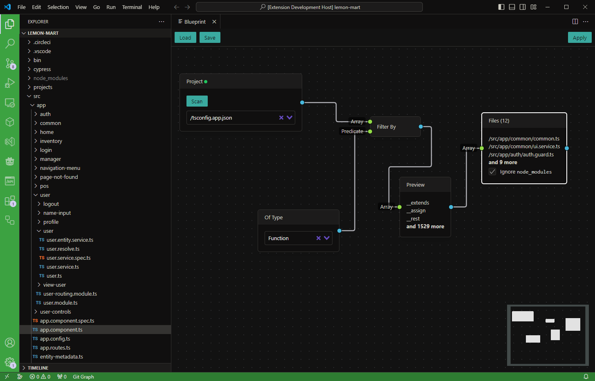

# bp-refactoring

Refactor using blueprints

## Features

...

## Extension Settings

...

## Known Issues

Nothing works yet

## Release Notes

### 1.0.0

Initial release of bp-refactoring

## How to add new node type
1. Add node type in `shared/node-types.ts`
2. Add node backend in `blueprint/nodes`
3. Add node processing in `blueprint/store.ts`
4. Add node frontend in `webview/nodes`
5. Add node in graph in `webview/Graph.vue`
